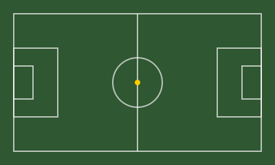

# 05 — Grafiska Element

Grafiska element är verktyg, inte dekoration. De skapar struktur, kontrast och rytm. Fyra element bär systemet.

## Stenmurslinjen

Bruten linje av varierande färgblock — bygger på stenmurens logik. Smålänningar byggde stenmurar av det som låg i vägen och förvandlade hinder till ordning. Linjen är aldrig perfekt jämn — det är meningen.

**Beskrivning:** Rektangulära block i varierande bredd i en horisontell rad. Primärfärg är Smålandsröd `#A91C1C`, med inslag av Skogsgrön `#2F5731` och Matchgul `#FECB00`. Inget block är identiskt med ett annat.

**Användningsområden:**
- Avdelare i trycksaker och presentationer
- Sidhuvud och sidfot i utbildningsmaterial
- Rytmisk markör under rubriker
- Separeringsband på affischer och eventgrafik

*Känsla: Byggt för hand, men ordnat.*

---

## Planlinjen

Tunna vita linjer hämtade från fotbollsplanens kritlinjer. Planen är det enda stället i fotboll där allt är exakt — varje linje har ett syfte och ett rätt mått.

**Beskrivning:** Rena, geometriska linjer i Linnevit eller Kritlinje `#F2F2F2`. Representerar planens grid — mittlinje, straffområde, mittcirkel. Alltid mot mörk bakgrund: Skogsgrön `#2F5731` eller Kolsvart `#333333`.

**Användningsområden:**
- Bakgrundsgrid på omslag och eventgrafik
- Taktiska illustrationer och diagramunderlag
- Strukturlinjer i presentationslayouter
- Informationsblock och faktarutor

*Känsla: Fotboll, struktur, riktning.*

---

## Lejonmönstret

Lejonet i låg opacitet eller som beskuren detalj — bär varumärket utan att skrika.

**Beskrivning:** Lejonet i sin enkla version, upprepat eller storskaligt beskuret. Opacitet 5–15 % mot ljus bakgrund, 10–25 % mot röd eller grön bakgrund. Kan centreras, överlappas i grid eller beskäras vid kanten för dynamik.

**Användningsområden:**
- Bakgrunder på omslags- och framsidor
- Vattenmärke på diplom och certifikat
- Fyllnadselement på stora ytor
- Texturlag under fotografier med toning

Aldrig bakom löpande brödtext. Aldrig med detaljer som försvinner vid låg opacitet.

*Känsla: Identitet utan att skrika.*

---

## 80-talsblocket

Färgfält i rött, grönt, beige och gul accent — alltid i enkel geometri. Aldrig diagonaler för diagonalernas skull.

**Beskrivning:** Rektangulära block i SmFF:s primärfärger. Smålandsröd dominerar, med Skogsgrön, Torparbeige och Matchgul som komplement. Blocken skapar tydliga zoner: en för rubrik, en för bild, en för logotyp. Inga rundningar, ingen toning, inga mjuka övergångar.

**Användningsområden:**
- Kampanjaffischer och matchdagsgrafik
- Omslag till utbildningsmaterial och jubileumsprodukter
- Sociala medier-mallar med hög visuell energi
- Eventväggar och fysisk dekoration

*Känsla: Nostalgisk energi, modern precision.*

---

[← 04 Typografi](04-typografi.md) | [Nästa — 06 Röst & Ton →](06-rost-och-ton.md)
