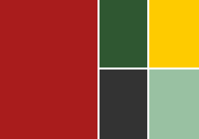

---
layout:
  width: default
  title:
    visible: true
  description:
    visible: true
  tableOfContents:
    visible: true
  outline:
    visible: false
  pagination:
    visible: false
  metadata:
    visible: true
  tags:
    visible: true
---

# Färgblocket

## 80-talsblocket

Färgfält i rött, grönt, beige och gul accent — alltid i enkel geometri. Aldrig diagonaler för diagonalernas skull.

**Beskrivning:** Rektangulära block i SmFF:s primärfärger. Smålandsröd dominerar, med Skogsgrön, Torparbeige och Matchgul som komplement. Blocken skapar tydliga zoner: en för rubrik, en för bild, en för logotyp. Inga rundningar, ingen toning, inga mjuka övergångar.

**Användningsområden:**

* Kampanjaffischer och matchdagsgrafik
* Omslag till utbildningsmaterial och jubileumsprodukter
* Sociala medier-mallar med hög visuell energi
* Eventväggar och fysisk dekoration

_Känsla: Nostalgisk energi, modern precision._

***
