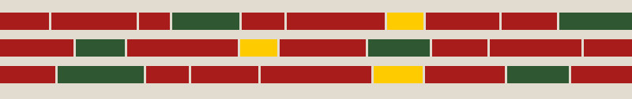

# Stenmurslinjen

## Stenmurslinjen

Bruten linje av varierande färgblock — bygger på stenmurens logik. Smålänningar byggde stenmurar av det som låg i vägen och förvandlade hinder till ordning. Linjen är aldrig perfekt jämn — det är meningen.

**Beskrivning:** Rektangulära block i varierande bredd i en horisontell rad. Primärfärg är Smålandsröd `#A91C1C`, med inslag av Skogsgrön `#2F5731` och Matchgul `#FECB00`. Inget block är identiskt med ett annat.

**Användningsområden:**

* Avdelare i trycksaker och presentationer
* Sidhuvud och sidfot i utbildningsmaterial
* Rytmisk markör under rubriker
* Separeringsband på affischer och eventgrafik

_Känsla: Byggt för hand, men ordnat._

***

##
