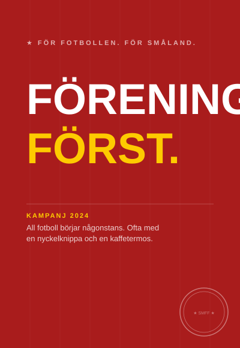
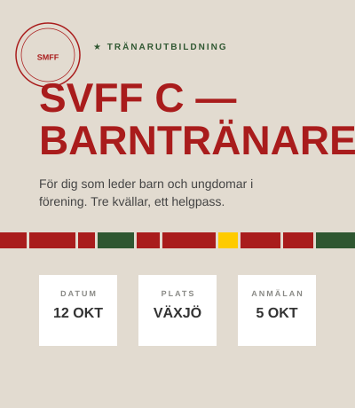

# 07 — Tillämpningar

Affisch, utbildningskort, matchdräkt, serietabell. När identiteten möter verkligheten ska den kännas igen på tre meters håll — och ändå hålla för granskning på nära håll.

## Affisch

Kampanjaffischen är SmFF:s starkaste enskilda kommunikationsformat.

**Kampanjprinciper:**
- En primär rubrik i SvFF Trim — kraftfull, versaler, aldrig mer än fyra ord
- En tagline i Stag Sans Regular, versaler, i låg opacitet ovanför rubriken
- Logotyp nedre höger, 15 % av längsta sidan
- Ingen brödtext — det som inte ryms i rubriken ryms inte på affischen

**Layout:**
- Röd bakgrund som standard
- Nyckelord eller siffra i Matchgul `#FECB00` som accent i rubriken
- Kampanjmeta (datum, plats, kort beskrivning) i Stag Sans Regular med tunn horisontell linje ovan
- Lejonet som vattenmärke vid 10–15 % opacitet i bakgrunden

---

## Utbildningskort — Modus-format

Utbildningskort är SmFF:s sätt att paketera lärande. Kompakt, användbart, direkt.

**Grid — tre zoner:**
- Övre zon: SmFF-emblem + kategori i Stag Sans Semibold versaler (Skogsgrön)
- Mittzon: Titel i SvFF Trim (Smålandsröd) + kort beskrivning i Stag Sans Book, max 40 ord
- Nedre zon: Stenmurslinje + tre detaljfält (datum, plats, anmälningsdatum)

**Färgroller:**
- Smålandsröd titel signalerar: det här är det viktigaste
- Skogsgrön kategori signalerar: vilken typ av utbildning
- Torparbeige bakgrund signalerar: SmFF:s material

---

## Matchdräkt

**Färgval:**
- Hemma: Skogsgrön tröja, vit text och detaljer, Matchgul som accentfärg
- Borta: Linnevit tröja, Smålandsröd text och detaljer
- Målvakt: separat färgval enligt SvFF:s riktlinjer

**Nummerhantering:**
- Stora siffror i Oswald/SvFF Trim-stil — tydlighet på avstånd prioriteras
- Matchgul accent används för nummer eller detaljer i hemmaställ
- Namntext under nummer: Stag Sans Semibold
- SmFF-emblem på vänster bröst, 50 mm minimum

---

## Serietabell

Serietabellen är ett funktionellt format — läsbarhet före branding.

**Typografi:**
- Kolumnhuvud: Stag Sans Semibold versaler, tracking 0.18em, dämpad opacitet
- Lagnamn: SvFF Trim eller Oswald — läses snabbt på avstånd
- Poäng: SvFF Trim Bold, Matchgul `#FECB00` — det viktigaste siffervärdet
- Övriga tal: Stag Sans Regular, dämpad färg

**Exempeldata — Division 2 Södra Götaland, Omgång 18:**

| # | Lag | M | P |
|---|---|---|---|
| **1** | **Husqvarna FF** | 18 | **38** |
| 2 | Nässjö FF | 18 | 34 |
| 3 | Vimmerby IF | 18 | 31 |
| 4 | Kalmar FF U21 | 18 | 28 |
| 5 | Värnamo IK | 18 | 24 |
| 6 | Eksjö City | 18 | 22 |

Kolsvart bakgrund `#333333` ger kontrast och seriositet. Tabelltitel i Stag Sans Semibold versaler med ★-markör.

---

## Webb

Webb-kontexten styrs av SvFF:s plattform på smalandsfotbollen.se. SmFF kontrollerar innehåll, ton och bildval — inte grunddesign.


På smalandsfotbollen.se gäller SvFF-primärt läge. Använd aldrig SmFF:s röd-gröna designelement mot SvFF-plattformens egna element — det skapar visuell konflikt.


**Block och knappar:**
- CTA-knappar: Smålandsröd bakgrund `#A91C1C`, Linnevit text, Stag Sans Semibold
- Informationsblock: Torparbeige bakgrund för SmFF-specifikt innehåll
- Lejonet som vattenmärke i hero-sektioner: 5–15 % opacitet, aldrig bakom brödtext

---

## Sociala medier

**Mallstruktur:**
- Logotyp alltid nedre höger (undantag: profilbild)
- Rubrik i SvFF Trim versaler vid grafiska inlägg
- Matchgul som accentfärg för energi och markeringar
- Inga drop shadows eller effekter

**Fem rubriker som fungerar:**
1. "★ FÖR FOTBOLLEN. FÖR SMÅLAND."
2. "Lördag 14:00. Husqvarna FF möter Vimmerby IF. Ta med kaffe — det kan ta ett tag."
3. "Föreningarna är grunden. Vi bygger tillsammans, en match i taget."
4. "Nya domare. Nya ledare. Samma hjärta."
5. "Vi är inte fotbollens centrum — vi är dess ryggrad."

Alla fem är korta. Alla fem påstår något. Ingen förklarar bara ett ämne.

---

## Presentationer

Presentationsmalen är **SmFF.thmx** — används alltid. Skapa aldrig en fristående presentation utanför mallen.



- Röd bakgrund `#A91C1C` (primärt) eller Linnevit
- Titel i SvFF Trim — stora versaler, utan kompromissr
- Undertitel, datum, avsändare i Stag Sans Book
- Logotyp centrerat eller nedre höger

Omslaget signalerar att vi kommit igång.



- Vit bakgrund som standard
- Rubrik i Calibri Bold versaler (röd) — en rubrik som påstår, aldrig namnger
- Max en huvudtanke per slide
- Logotyp behövs inte på varje sida

**Rubrik som påstår — inte namnger:**

| Skriv inte | Skriv |
|---|---|
| Verksamhetsplan 2025 | Det här fokuserar vi på 2025 — och varför |
| Ekonomi | Ekonomin är i balans — men vi ser tre risker framåt |
| Utbildningsstatistik | Fler ledare utbildar sig — trenden håller i sig |



---

## Merchandise

Rekommenderade produkter från SmFF:s standardsortiment.

| Produkt | Logotyp | Placering | Teknik |
|---|---|---|---|
| **T-shirt / träningströja** | Emblem eller lejon | Vänster bröst | Screentryck |
| **Jacka** | Fullständigt emblem | Vänster bröst | Brodyr |
| **Keps** | Lejon (enkel version) | Frontpanel, centrerat | Brodyr |
| **Tygkasse** | Fullständigt emblem | Centrerat, framsida | Screentryck |
| **Mugg** | Emblem | Höger sida vid grepp | Transfer |
| **Anteckningsbok** | Emblem | Framsida, nedre höger | Prägling |
| **Penna** | Emblem (minimal) | Längs sidan | Rollstämpel |


Primärfärg på merchandise är alltid **röd** — rött plagg med vit logotyp, eller vitt plagg med röd logotyp. Blå merchandise tillhör SvFF-kontexten, inte SmFF. Godkänn alltid ett provtryck innan serieproduktion.


---

[← 06 Röst & Ton](06-rost-och-ton.md) | [Nästa — 08 Rätt & Fel →](08-ratt-och-fel.md)
