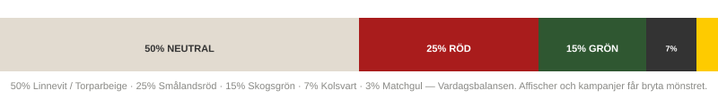
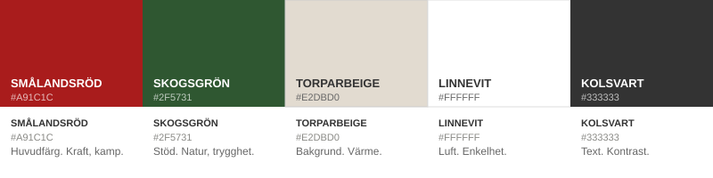
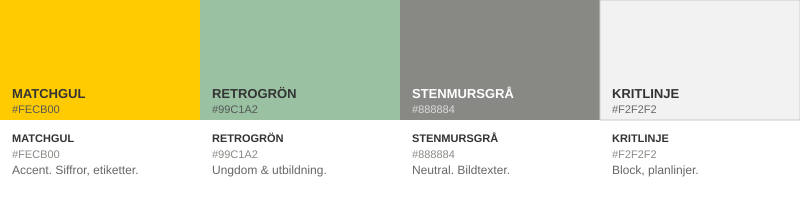

# Proportioner och kombinationer

## Proportionsregeln

Färger i rätt proportion är skillnaden mellan identitet och kaos. Regeln gäller vardagsbalansen — affischer och kampanjer får bryta mönstret.

**50 — 25 — 15 — 7 — 3**

| Del      | Färg                   | Förklaring                                                         |
| -------- | ---------------------- | ------------------------------------------------------------------ |
| **50 %** | Linnevit / Torparbeige | Neutral grund. Ger luft, läsbarhet och utrymme för allt annat.     |
| **25 %** | Smålandsröd            | Primärfärgen. Det starkaste visuella budskapet.                    |
| **15 %** | Skogsgrön              | Djup och kontrast. Alltid stödjande — aldrig i konkurrens med röd. |
| **7 %**  | Kolsvart               | Text, grafik och hårda kontraster.                                 |
| **3 %**  | Matchgul accent        | Energi och kampanj. Sparsamt och med ett tydligt syfte varje gång. |


**Förbjudna kombinationer:**

* Rött och grönt i 50/50-balans — röd är alltid primär
* Linnevit text på Torparbeige — otillräcklig kontrast
* Accentfärger utan grön eller beige mellanlägg — skapar vibration
* Neon som huvuduttryck — accentfärger är sekundära redskap
* Fler än tre färger på en yta — utan specifikt designgodkännande


***

## Primär palett

| Namn            | Hex       | Roll                               |
| --------------- | --------- | ---------------------------------- |
| **Smålandsröd** | `#A91C1C` | Huvudfärg. Kraft, kamp, identitet. |
| **Skogsgrön**   | `#2F5731` | Stöd. Natur, trygghet, framtid.    |
| **Torparbeige** | `#E2DBD0` | Bakgrund. Värme, historia.         |
| **Linnevit**    | `#FFFFFF` | Luft. Enkelhet, tydlighet.         |
| **Kolsvart**    | `#333333` | Text. Kontrast, verkstadskänsla.   |

## 80-talsaccent — sparsamt och kontrollerat

| Namn            | Hex       | Användning                            |
| --------------- | --------- | ------------------------------------- |
| **Matchgul**    | `#FECB00` | Accent. Siffror, etiketter, matchdag. |
| **Retrogrön**   | `#99C1A2` | Ungdom & utbildning.                  |
| **Stenmursgrå** | `#888884` | Neutral. Detaljer, bildtexter.        |
| **Kritlinje**   | `#F2F2F2` | Block, planlinjer, raster.            |


80-talsaccenterna är inte en parallell palett. De är redskap för specifika kommunikationssituationer — kampanjer, matchdagsgrafik, liverapportering. Sparsamt och kontrollerat. Aldrig som primärfärg.

