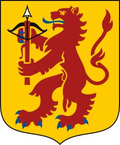

# Primärpalett

<table data-card-size="large" data-view="cards"><thead><tr><th></th><th></th><th></th><th></th><th></th><th data-hidden data-card-cover data-type="image">Cover image</th></tr></thead><tbody><tr><td><h4>Smålandsröd</h4></td><td><code>#A91C1C</code></td><td>Huvudfärg. Kraft, kamp, identitet.</td><td>Inspirerad av de traditionella röda stugorna och vapnets lejon. Den förkroppsligar envishet, mod och det folkliga hjärtat i rörelsen.</td><td>Står för identitet, tradition, mod, beslutsamhet och folklighet. Kan med fördel användas till rubriker, knappar, viktiga markeringar och som identitetsbärare.</td><td><a href="https://singlecolorimage.com/get/A91C1C/300x175">https://singlecolorimage.com/get/A91C1C/300x175</a></td></tr><tr><td><h4>Matchgul</h4></td><td><code>#FECB00</code></td><td>Accent. Siffror, etiketter, matchdag.</td><td></td><td></td><td><a href="https://singlecolorimage.com/get/FECB00/300x175">https://singlecolorimage.com/get/FECB00/300x175</a></td></tr></tbody></table>

***

### Inspiration från det småländska landskapsvapnet



<figure><figcaption></figcaption></figure>



Landskapsvapnet faställdes i sin nuvarande tappning av kung Johan III, vid hans kröning 1569, och är hämtat från Folkungaättens vapen.

> ”I gyllene fält ett rött lejon med blå beväring och hållande i tassarna ett uppåtvänt rött armborst med pilspets av silver samt båge och strängar svarta.”


