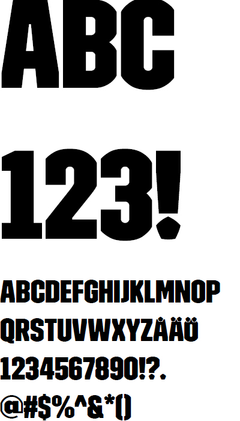
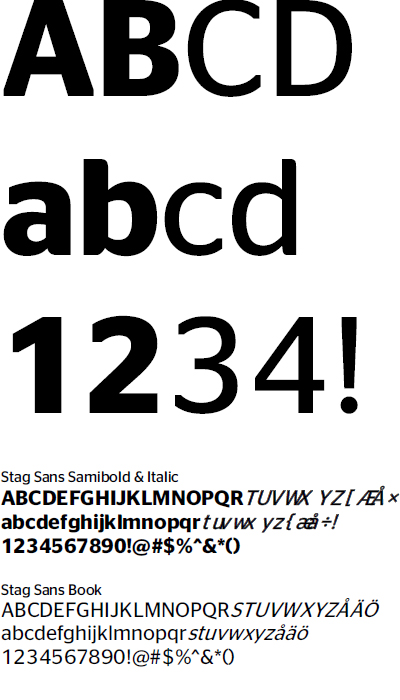

# Typografi

Smålands Fotbollförbund har samma typografi som Svenska Fotbollförbundet. Det innebär ’SvFF Trim’ för övergripande rubriker, samt ’Stag Sans’ för underrubriker, brödtext och informationstexter.




SvFF Trim


<figure><figcaption></figcaption></figure>






Stag Sans


<figure><figcaption></figcaption></figure>





Fallbacklösning av teckensnitt som används är ’Calibri’ ifall ovanstående inte finns att tillgå.

Teckensnitten och färgsättningen ska vara enkel, tydlig och lätt att läsa i alla sammanhang.
